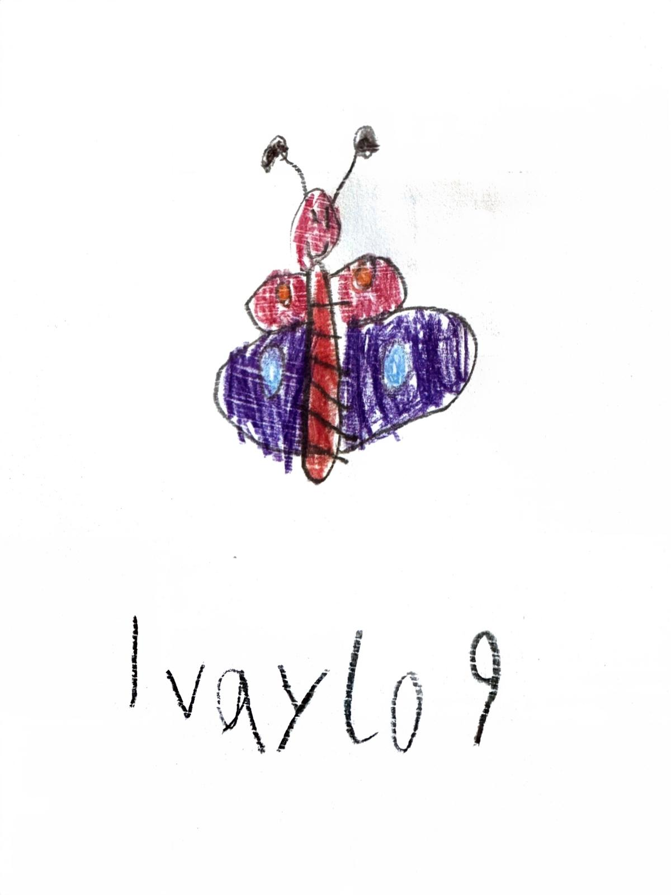
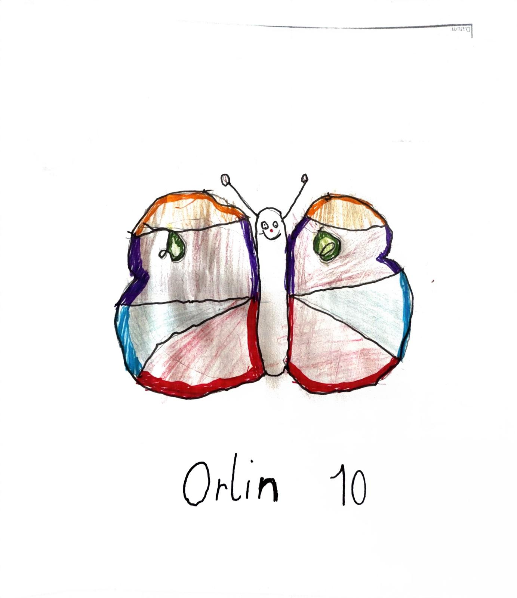
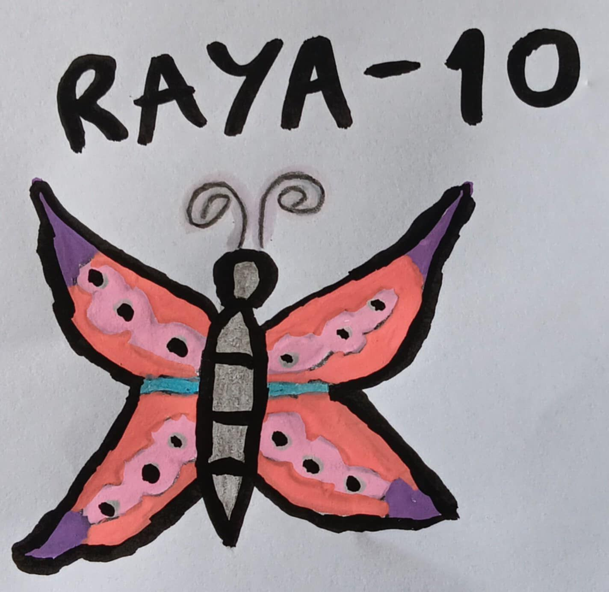
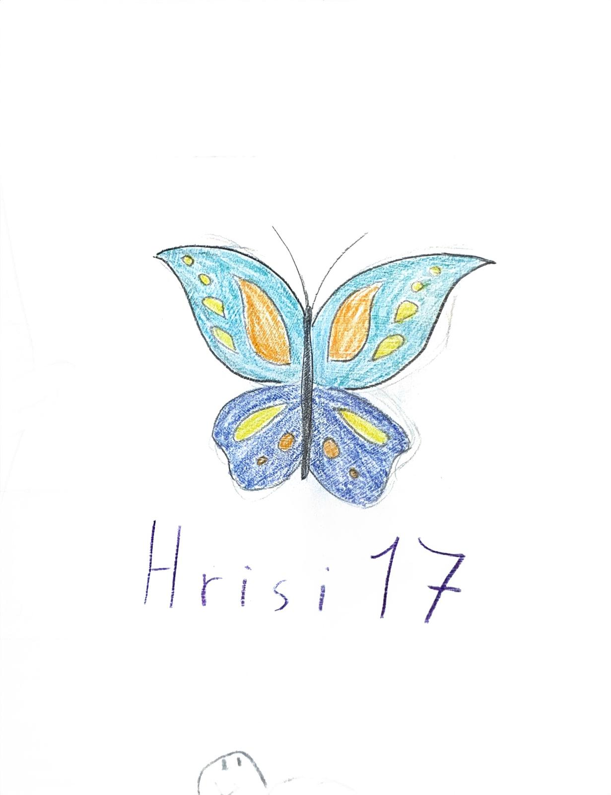
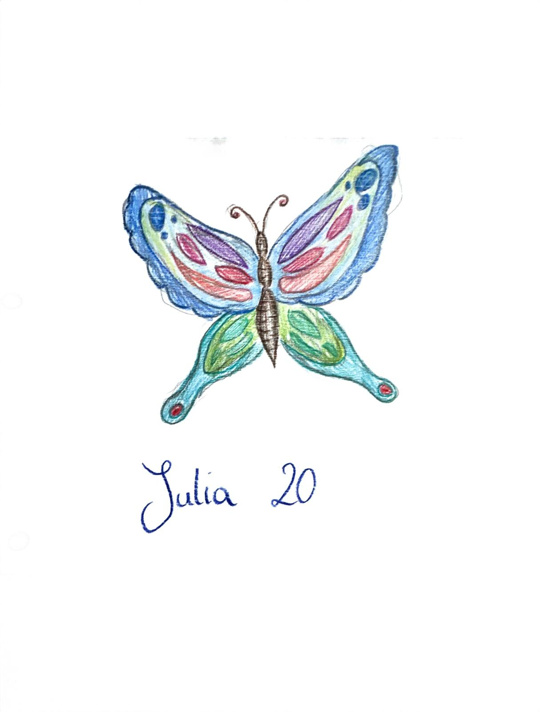
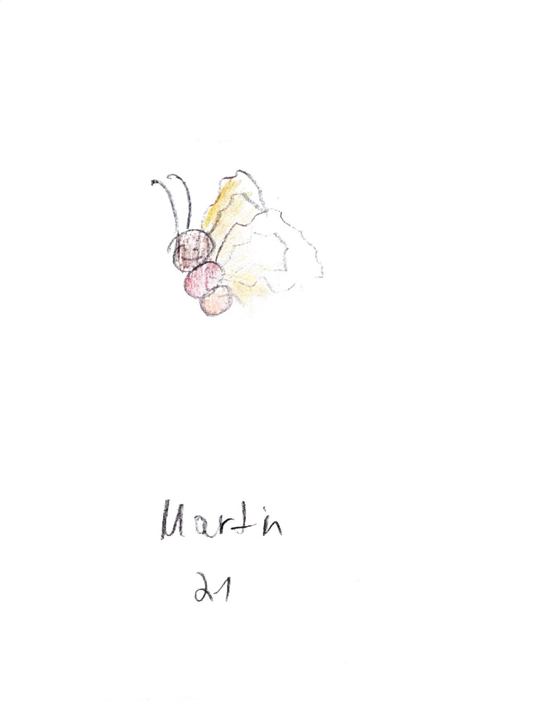
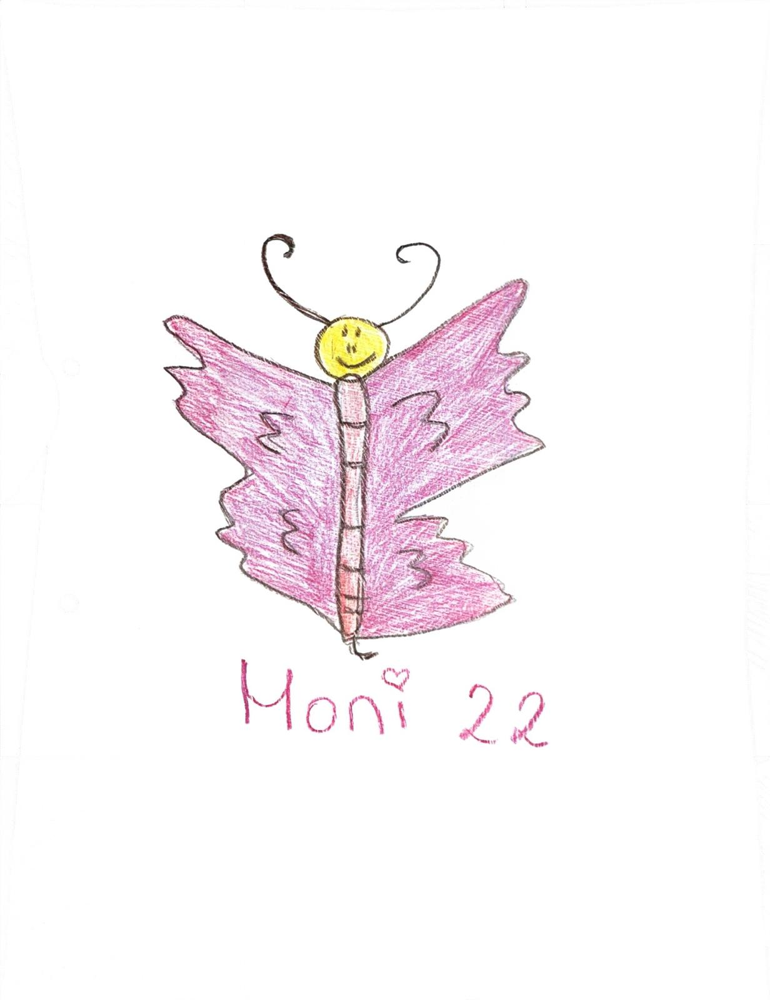

<html lang="de">
<head>
  <meta charset="UTF-8">
</head>
<body>
  

    <h1>Einzigartige Schmetterlinge!</h1>
    
Die Schmetterlinge sind von meine Familie gezeichnet worden im unterschiedlichen Alters Gruppen:

    
    
<b>Ein Schmetterling von Ivaylo, 9 </b>

    
    
<b>Ein Schmetterling von Orlin, 10 </b>

    
    
<b>Ein Schmetterling von Raya, 10 </b>

     
    p><b>Ein Schmetterling von Hrisi, 17 </b>

    
    
<b>Ein Schmetterling von Julia, 20 </b>

    
    
<b>Ein Schmetterling von Martin, 21 </b>

    
    
<b>Ein Schmetterling von Moni, 22</b>

    
Das waren die individuelle Schmetterlinge. 
    Danke, dass Sie die Webseite besucht haben. :)

  
 
</body>
</html>
